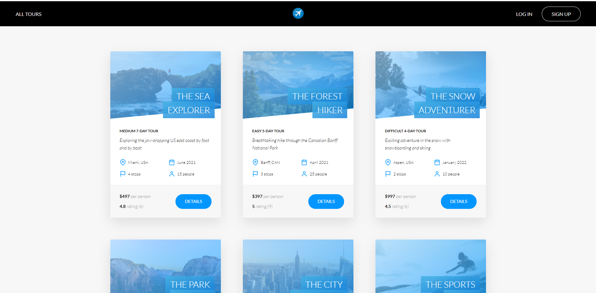

# MytravelApp



MyTravelApp is an app designed to solve the problems of travelers who wanna unique destinations around the world.


### Tech Stack

:rocket: Pug

:flying_saucer: Node

:artificial_satellite: MongoDB

:airplane: Express

# Features & Designs

The current design that I have for the app is to have eight different sections.


# To Contribute here (version control)

1. Click on Fork at the top right corner
2. Clone your forked repository
3. `cd` into the cloned folder | GrowersBrains
4. `git remote add upstream https://github.com/kabasele243/mytravelapp`
5. `git pull upstream` <YOUR_BRANCH>
6. Check out to the task branch by `git checkout -b` <NAME_OF_THE_TASK>

# To run the app in development

1. Run `npm install` from the **root** and also from the **client** folder
2. run `npm run dev` from the root
   Note: If you want to run backend only, run `npm run start`

## Set environment variables

You can create a .env file in your root project folder and add theses configurations. Be sure to modify the values beforehand. **_Never commit .env file to github._**

```bash
NODE_ENV=development
PORT=YOUR_PORT
DATABASE=YOUR_MONGO_URI
DATABASE_PASSWORD=YOUR_MONGO_PASSWORD

JWT_SECRET=YOUR_JWT_SECRET
JWT_EXPIRES_IN=YOUR_EXPIRATION_DATE
JWT_COOKIE_EXPIRES_IN=YOUR_TIME_LIKE_40

```

# Creating a pull request (when done with your code/changes)

1. Run `git add .`
2. Run `git commit -m` <COMMIT_MESSAGE>
3. `git push origin` <BRANCH_NAME>

Go to the repository https://github.com/kabasele243/mytravelapp.

As soon as you get there, you are going to see a green **Compare and Create a pull request**.

Click on it and type your message then click on **Create pull request**.


# Getting Started / Installation


Trello board: https://trello.com

# Team

:computer: Software Engineer: **@kabasele**


# Handy Resources

- [React.js official documentation](https://reactjs.org/docs/getting-started.html)
